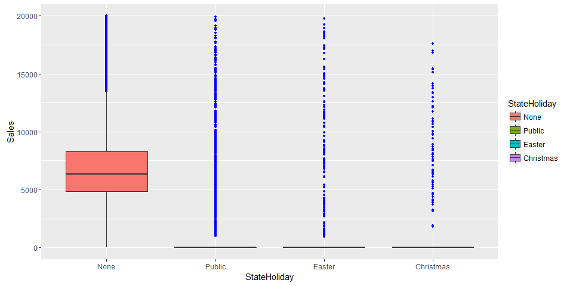
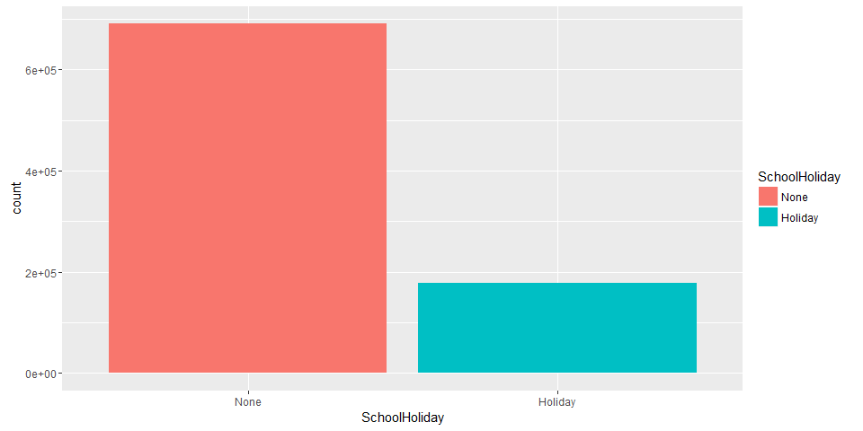
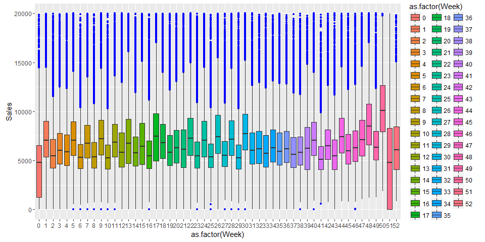
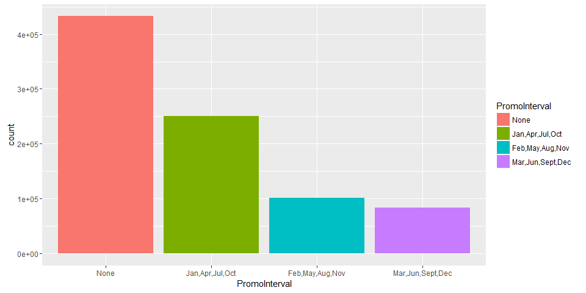

# Exploring rossmann store sales
NighTurs  
November 5, 2015  

The website for this competition is https://www.kaggle.com/c/rossmann-store-sales


Read data


```r
train <- fread("data/train.csv", head = T, sep = ',')
stores <- fread("data/store.csv", head = T, sep = ',')
data <- merge(train, stores, by = "Store")
row_count <- nrow(data)
col_count <- ncol(data)
cat("Row count : ", row_count, "; Columns count : ", col_count)
```

```
## Row count :  1017209 ; Columns count :  18
```

First glance at columns and values


```r
str(data)
```

```
## Classes 'data.table' and 'data.frame':	1017209 obs. of  18 variables:
##  $ Store                    : int  1 1 1 1 1 1 1 1 1 1 ...
##  $ DayOfWeek                : int  5 4 3 2 1 7 6 5 4 3 ...
##  $ Date                     : chr  "2015-07-31" "2015-07-30" "2015-07-29" "2015-07-28" ...
##  $ Sales                    : int  5263 5020 4782 5011 6102 0 4364 3706 3769 3464 ...
##  $ Customers                : int  555 546 523 560 612 0 500 459 503 463 ...
##  $ Open                     : int  1 1 1 1 1 0 1 1 1 1 ...
##  $ Promo                    : int  1 1 1 1 1 0 0 0 0 0 ...
##  $ StateHoliday             : chr  "0" "0" "0" "0" ...
##  $ SchoolHoliday            : chr  "1" "1" "1" "1" ...
##  $ StoreType                : chr  "c" "c" "c" "c" ...
##  $ Assortment               : chr  "a" "a" "a" "a" ...
##  $ CompetitionDistance      : int  1270 1270 1270 1270 1270 1270 1270 1270 1270 1270 ...
##  $ CompetitionOpenSinceMonth: int  9 9 9 9 9 9 9 9 9 9 ...
##  $ CompetitionOpenSinceYear : int  2008 2008 2008 2008 2008 2008 2008 2008 2008 2008 ...
##  $ Promo2                   : int  0 0 0 0 0 0 0 0 0 0 ...
##  $ Promo2SinceWeek          : int  NA NA NA NA NA NA NA NA NA NA ...
##  $ Promo2SinceYear          : int  NA NA NA NA NA NA NA NA NA NA ...
##  $ PromoInterval            : chr  "" "" "" "" ...
##  - attr(*, ".internal.selfref")=<externalptr> 
##  - attr(*, "sorted")= chr "Store"
```

Crafting and transforming variables needed for all future analysis


```r
data$Open = factor(data$Open, levels = c(0, 1), labels = c("Closed", "Open"))
data$Promo = factor(data$Promo, levels = c(0, 1), labels = c("None", "Promo"))
data$StateHoliday = factor(data$StateHoliday, levels = c("0", "a", "b", "c"), labels = c("None", "Public", "Easter", "Christmas"))
data$SchoolHoliday = factor(data$SchoolHoliday, levels = c("0", "1"), labels = c("None", "Holiday"))
data$StoreType = factor(data$StoreType, levels = c("c", "a", "d", "b"), labels = c("C", "A", "D", "B"))
data$Assortment = factor(data$Assortment, levels = c("a", "c", "b"), labels = c("Basic", "Extended", "Extra"))
data$Promo2 = factor(data$Promo2, levels = c(0, 1), labels = c("None", "Promo"))
data$PromoInterval = factor(data$PromoInterval, levels = c("", "Jan,Apr,Jul,Oct", "Feb,May,Aug,Nov", "Mar,Jun,Sept,Dec"), labels = c("None", "Jan,Apr,Jul,Oct", "Feb,May,Aug,Nov", "Mar,Jun,Sept,Dec"))
data$Promo2SinceWeek[is.na(data$Promo2SinceWeek)] <- -1
data$Promo2SinceYear[is.na(data$Promo2SinceYear)] <- -1
data$CompetitionOpenSinceMonth[is.na(data$CompetitionOpenSinceMonth)] <- -1
data$CompetitionOpenSinceYear[is.na(data$CompetitionOpenSinceYear)] <- -1
data$CompetitionDistance[is.na(data$CompetitionDistance)] <- -1
data$Date = as.Date(data$Date)
data$DayOfYear = as.integer(format(data$Date, "%j"))
data$Year = as.integer(format(data$Date, "%Y"))
data$Week = as.integer(format(data$Date, "%U"))
data$Month = as.integer(format(data$Date, "%m"))
tmp <- paste(data$Promo2SinceYear, data$Promo2SinceWeek, rep("1", nrow(data)), sep = " ")
data$Promo2Date <- do.call(c, lapply(tmp, function(d) {as.Date(d, format = "%Y %U %u")}))
data$Promo2Days <- as.integer(difftime(data$Date, data$Promo2Date, units = "days"))
```

Are there still any NA's? (Promo2Date, Promo2Days are expected to have them)

```r
which(data[,colSums(is.na(data))>0])
```

```
## Promo2Date Promo2Days 
##         23         24
```

Do we have missing Dates in Stores (Assuming first store has full set of dates)?

```r
byStore <- data[,.N,by = Store]
byStore[,.N, by = N]
```

```
##      N   N
## 1: 942 934
## 2: 758 180
## 3: 941   1
```

A lot of Stores miss ~200 dates... Let's see what are this dates

```r
full_store <- head(byStore[byStore$N == 942], n = 1)$Store
miss1_store <- head(byStore[byStore$N == 758], n = 1)$Store
miss2_store <- head(byStore[byStore$N == 941], n = 1)$Store

miss1_dates <- as.Date(setdiff(data[data$Store == full_store]$Date, data[data$Store == miss1_store]$Date), origin = "1970-01-01")
head(miss1_dates, n = 10)
```

```
##  [1] "2014-12-31" "2014-12-30" "2014-12-29" "2014-12-28" "2014-12-27"
##  [6] "2014-12-26" "2014-12-25" "2014-12-24" "2014-12-23" "2014-12-22"
```

```r
tail(miss1_dates, n = 10)
```

```
##  [1] "2014-07-10" "2014-07-09" "2014-07-08" "2014-07-07" "2014-07-06"
##  [6] "2014-07-05" "2014-07-04" "2014-07-03" "2014-07-02" "2014-07-01"
```

```r
as.Date(setdiff(data[data$Store == full_store]$Date, data[data$Store == miss2_store]$Date), origin = "1970-01-01")
```

```
## [1] "2013-01-01"
```

Looking at Sales summaries

```r
summary(data$Sales)
```

```
##    Min. 1st Qu.  Median    Mean 3rd Qu.    Max. 
##       0    3727    5744    5774    7856   41550
```

```r
summary(data[data$Open == "Closed", ]$Sales)
```

```
##    Min. 1st Qu.  Median    Mean 3rd Qu.    Max. 
##       0       0       0       0       0       0
```

Lets remove all rows with store being closed, and also cap Sales by 20000

```r
all_data <- copy(data)
filtered_data <- data[data$DayOfWeek != 7 & data$Sales <= 20000]
data <- filtered_data
```

Plot sales

```r
ggplot(data) + aes(Sales) + geom_histogram(binwidth = 50, fill = "blue", alpha = 0.5)
```

<!-- -->

Plot how promo affects sales

```r
ggplot(data) + aes(Promo, fill = Promo) + geom_bar()
```

<!-- -->

```r
ggplot(data) + aes(Sales, fill = Promo) + geom_histogram(binwidth = 50, position = "identity", alpha = 0.5)
```

<!-- -->

Store types 

```r
ggplot(data) + aes(StoreType, fill = Assortment) + geom_bar()
```

<!-- -->

```r
ggplot(data) + aes(StoreType, Sales, fill = Assortment) + geom_boxplot(outlier.size = 1, outlier.colour = "blue")
```

<!-- -->

Holidays

```r
table(data$StateHoliday)
```

```
## 
##      None    Public    Easter Christmas 
##    837846     19928      6680      4096
```

```r
ggplot(data) + aes(StateHoliday, Sales, fill = StateHoliday) + geom_boxplot(outlier.size = 1, outlier.colour = "blue")
```

<!-- -->

```r
ggplot(data) + aes(SchoolHoliday, fill = SchoolHoliday) + geom_bar()
```

<!-- -->

```r
ggplot(data) + aes(SchoolHoliday, Sales, fill = SchoolHoliday) + geom_boxplot( outlier.size = 1, outlier.colour = "blue")
```

<!-- -->

How school holidays are distributed throught weekdays?

```r
ggplot(data) + aes(as.factor(DayOfWeek), fill = SchoolHoliday) + geom_bar()
```

<!-- -->

Lets check for seasonality patterns, first only 2014. Can observe almost perfect 2 weeks seasonality, expect some rare cases when this pattern gets interrupted at the end of first week. Vertical lines are start and end of test data for 2015 year.

```r
ggplot(data[data$Year == 2014]) + aes(DayOfYear, Sales, group = Year, colour = as.factor(Year)) + stat_summary(fun.y = median, geom = "line", size = 3) + geom_vline(xintercept = data[data$Year == 2014 & data$DayOfWeek == 1]$DayOfYear, colour = "grey") + stat_summary(fun.y = median, aes(colour = as.factor(DayOfWeek)), geom = "point", size = 5) + scale_colour_hue("clarity") + scale_x_discrete(breaks = data[data$Year == 2014 & data$DayOfWeek == 1]$DayOfYear) + geom_vline(xintercept = c(213, 260))
```

<!-- -->

There is also seems to be a years pattern, although it is largelly spoiled by incomplete weekly pattern (sometimes it causes differencies between years as can be seen in august) (plotting only Mondays)

```r
ggplot(data[data$DayOfWeek == 1]) + aes(DayOfYear, Sales, group = Year, colour = as.factor(Year)) + stat_summary(fun.y = median, geom = "line", size = 3) + geom_vline(xintercept = c(213, 260)) + stat_summary(fun.y = median, aes(colour = as.factor(DayOfWeek)), geom = "point", size = 5) + scale_colour_hue("clarity") + geom_vline(xintercept = data[data$DayOfWeek == 1]$DayOfYear, colour = "grey") + scale_x_discrete(breaks = data[data$Year == 2014 & data$DayOfWeek == 1]$DayOfYear) + theme(axis.text.x = element_text(angle = 90, hjust = 1))
```

<!-- -->

Also lets check sales distribution by weekdays, months and weeks

```r
ggplot(data) + aes(as.factor(DayOfWeek), fill = DayOfWeek) + geom_bar()
```

<!-- -->

```r
ggplot(data) + aes(as.factor(DayOfWeek), Sales, fill = DayOfWeek) + geom_boxplot( outlier.size = 1, outlier.colour = "blue")
```

<!-- -->

```r
ggplot(data) + aes(as.factor(Week), Sales, fill = as.factor(Week)) + geom_boxplot( outlier.size = 1, outlier.colour = "blue")
```

<!-- -->

```r
ggplot(data) + aes(as.factor(Month), Sales, fill = as.factor(Month)) + geom_boxplot( outlier.size = 1, outlier.colour = "blue")
```

<!-- -->

How does consequitive promo affects sales?

```r
ggplot(data) + aes(PromoInterval, fill = PromoInterval) + geom_bar()
```

<!-- -->

```r
ggplot(data) + aes(PromoInterval, Sales, fill = PromoInterval) + geom_boxplot( outlier.size = 1, outlier.colour = "blue")
```

<!-- -->

```r
ggplot(data[!is.na(data$Promo2Date)]) + aes(Promo2Days, Sales, group = round_any(Promo2Days, 100), fill = round_any(Promo2Days, 100)) + geom_boxplot( outlier.size = 1, outlier.colour = "blue")
```

<!-- -->

How does competition affects sales? Seems like competitions is good (of course it can be biased by some confounding variables)

```r
ggplot(data[data$CompetitionDistance > -1 & data$CompetitionDistance < 35000]) + aes(CompetitionDistance, Sales, group = round_any(CompetitionDistance, 1000), fill = round_any(CompetitionDistance, 1000)) + geom_boxplot(outlier.size = 1, outlier.colour = "blue")
```

<!-- -->

```r
ggplot(data) + aes(CompetitionDistance > -1, Sales, fill = CompetitionDistance > -1) + geom_boxplot(outlier.size = 1, outlier.colour = "blue")
```

<!-- -->

Are there any stores that got competitor during our observation period?

```r
which(data[, length(unique(CompetitionDistance)), by = Store][,1] > 1)
```

```
## integer(0)
```

Back to seasonality. Lets try to remove all year weeks that spoil our almost perfect 2 week seasonality. For that I will leave only this days for each year (Now each year will also be adjusted by week day):
2013: 35 - 77, 155 - 266
2014: 34 - 76, 154 - 208, 216 - 272 (august is crucial to us, so I removed one week and shifted others)
2015: 35 - 75, 153 - *

```r
data <- all_data
data_cl <- data[((data$Year == 2013 & data$DayOfYear %in% c(35:77, 155:265)) | (data$Year == 2014 & data$DayOfYear %in% c(34:76, 154:208, 216:271)) |
(data$Year == 2015 & data$DayOfYear %in% c(33:75, 153:212))) & data$DayOfWeek != 7]
library(plyr)
data_cl[data_cl$Year == 2013]$DayOfYear <- mapvalues(data_cl[data_cl$Year == 2013]$DayOfYear, from = c(35:77, 155:265), to = 1:154)
data_cl[data_cl$Year == 2014]$DayOfYear <- mapvalues(data_cl[data_cl$Year == 2014]$DayOfYear, from = c(34:76, 154:208, 216:271), to = 1:154)
data_cl[data_cl$Year == 2015]$DayOfYear <- mapvalues(data_cl[data_cl$Year == 2015]$DayOfYear, from = c(33:75, 153:212), to = 1:103)
ggplot(data_cl) + aes(DayOfYear, Sales, group = Year, colour = as.factor(Year)) + stat_summary(fun.y = median, geom = "line", size = 3) + geom_vline(xintercept = c(104, 151)) + stat_summary(fun.y = median, aes(colour = as.factor(DayOfWeek)), geom = "point", size = 5) + scale_colour_hue("clarity") + geom_vline(xintercept = data_cl[data_cl$DayOfWeek == 1]$DayOfYear, colour = "grey") + scale_x_discrete(breaks = data_cl[data_cl$Year == 2014 & data_cl$DayOfWeek == 1]$DayOfYear) + theme(axis.text.x = element_text(angle = 90, hjust = 1))
```

<!-- -->

Now lets try to forecast 60 days of 2015 year (We already now Sales for them, so we can check how good our predictions are)

```r
library(forecast)
store1 <- data_cl[data_cl$Store == 1]
N <- 60
test <- store1[1:N]
train <- store1[(N + 1):nrow(store1)]
ts1 <- ts(rev(train$Sales), frequency = 132)
fit <- stl(ts1, s.window="periodic")
plot(fit)
```

<!-- -->

```r
ans <- forecast(fit, h = N)
plot(ans)
lines(ts(rev(store1$Sales), frequency = 132), col = "red")
```

<!-- -->

Lets do the same for couple of other stores

```r
stores <- c(50, 101, 150, 200)
for (store in stores) {
    st <- data_cl[data_cl$Store == store]
    N <- 60
    test <- st[1:N]
    train <- st[(N + 1):nrow(st)]
    store_ts <- ts(rev(train$Sales), frequency = 132)
    fit <- stl(store_ts, s.window="periodic")
    ans <- forecast(fit, h = N)
    plot(ans)
    lines(ts(rev(st$Sales), frequency = 132), col = "red")
}
```

<!-- --><!-- --><!-- --><!-- -->
